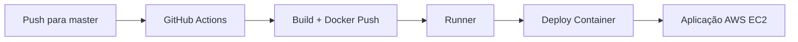

# 🔗 QR Code Generator API

Uma API REST desenvolvida em Java Spring Boot provisionada em um AWS EC2 para geração de QR Codes personalizados com
logo centralizado e upload automático para AWS S3.

## 📋 Sobre o Projeto

Esta API permite gerar QR Codes a partir de URLs, aplicando um logo personalizado no QR Code, e fazendo upload da imagem
gerada para um bucket S3 da AWS. O projeto utiliza uma breve arquitetura hexagonal (ports and adapters) para melhor
organização e testabilidade.

## 🚀 Funcionalidades

- ✅ Geração de QR Codes a partir de URL's
- ✅ Logo personalizado centralizado no QR Code
- ✅ Upload automático para AWS S3
- ✅ API REST documentada com Swagger/OpenAPI
- ✅ Containerização com Docker
- ✅ CI/CD automatizado com GitHub Actions + EC2 AWS
- ✅ Arquitetura hexagonal

## 🛠️ Stack Tecnológica

- **Java 21** + **Spring Boot 3.4.5**
- **Maven** - Gerenciamento de dependências
- **ZXing** - Biblioteca para geração de QR Codes
- **AWS SDK S3** - Upload de arquivos para S3
- **SpringDoc OpenAPI** - Documentação da API
- **Docker** - Containerização
- **GitHub Actions** - CI/CD
- **AWS EC2** - Infraestrutura de deploy

## 📁 Organização do Código

```
src/main/java/com/gaformario/generate/qrcode/
├── Application.java              # Classe principal Spring Boot
├── controller/
│   └── QrCodeController.java     # REST Controller
├── service/
│   └── QrCodeGeneratorService.java # Lógica de geração
├── dto/
│   ├── QrCodeRequest.java        # Request DTO
│   └── QrCodeResponse.java       # Response DTO
├── ports/
│   └── StoragePort.java          # Interface de armazenamento
└── infra/
    └── S3StorageAdapter.java     # Implementação AWS S3
```

## 🎨 Características do QR Code

- **Tamanho**: 300x300 pixels
- **Logo centralizado** com borda circular
- **Alta correção de erro** (Level H)
- **Cores personalizáveis**
- **Formato PNG** otimizado

## 🚀 Pipeline de Deploy

### CI/CD Automatizado com GitHub Actions

O projeto possui pipeline completamente automatizado em **2 estágios**:

#### 🏗️ **Build Stage**

- Roda em GitHub Actions (ubuntu-latest)
- Build da aplicação Java 21
- Criação da imagem Docker
- Push para DockerHub

#### 🚀 **Deploy Stage**

- Executa em **runner self-hosted** em **EC2 AWS**
- Pull da nova imagem Docker
- Deploy com zero downtime
- Aplicação disponível na porta 80

### Fluxo do Pipeline



### Infraestrutura AWS

- **EC2**: Instância para runner e hospedagem
- **S3**: Armazenamento das imagens QR Code
- **IAM**: Credenciais e permissões

<div align="center">
  
  
  
</div>

## 📖 API Endpoints

### Geração de QR Code

```http
POST /qr-code
Content-Type: application/json

{
  "text": "https://exemplo.com"
}
```

**Response:**

```json
{
  "url": "https://bucket.s3.region.amazonaws.com/uuid.png"
}
```

### Documentação

- **Swagger UI**: `/swagger-ui.html`
- **OpenAPI Spec**: `/v3/api-docs`

## ⚙️ Configuração

### Variáveis de Ambiente

```bash
AWS_REGION=sua-regiao
AWS_BUCKET_NAME=seu-bucket
AWS_ACCESS_KEY_ID=sua-key
AWS_SECRET_ACCESS_KEY=sua-secret
```

### Execução Local

```bash
# Clone e execute
git clone <repo-url>
docker build -t qrcode-api .
docker run --env-file .env -p 8080:8080 qrcode-api
```

---

⭐ Se este projeto foi útil para você, considere dar uma estrela no repositório!
